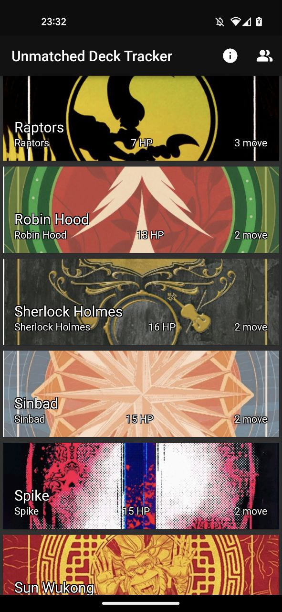
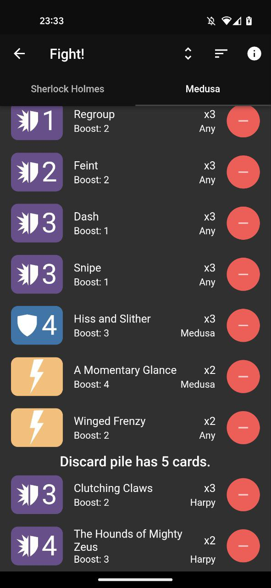

# Unmatched Deck Tracker

> This app is not published by or affiliated with Restoration Games. The card text is a copyright of Restoration Games, LLC. The look and design of the cards is a trademark of Restoration Games, LLC. They are used with permission.

As the name suggests, this is a deck tracker for the tabletop game Unmatched: Battle of Legends published by Restoration Games. It helps you remember what's left in your and your opponent's deck. 

 

## What the tracker is

First and foremost, the tracker is a passion project of one guy with a laptop. I am happy to have received the permission to use what I use (card names, texts and backs) from Restoration Games, and currently I am the only person working on it. Also, I am not a professional Flutter developer, nor am I a UI/UX designer. At my day job I do backend in C++. Importantly, I do not intend to spend any money nor receive any money with this project. That's just far beyond the goal. 

Currently the tracker contains the deck lists for all the official characters, except for Genie and Houdini. Up to two decks can be tracked at once. Some of the testers asked for the "Expand All/Collapse All" button, so one is in as well. 

## What's coming

At some point I'll move all of this section to the "Issues" tab. This is just a starter for everyone reading to get a taste of the short term plans

* The deck lists for Genie and Houdini. Boost tricks for Houdini;
* Special formatting for second attacks (see Volume 2 for examples);
* Special sort options for Little Red (by items on the left and by item used by the card);
* Some other things that will come up as user requests. Feel free to open an issue!

## The limitations

As I mentioned before, I am one guy developing this, and I do not intend to spend money. That puts some limitations on what can realistically be done. 

* In theory, this code can be build for Android, iOS, Windows, Linux and Mac OS. In practice, I only own a Windows laptop and an Android phone. If there is need, I will find a way to build Mac OS and Linux executables. However, there won't be a straigtforward way to install the tracker on iOS whatever I do. The only straightforward way to install an app on an iPhone is AppStore. One needs a developer account to post to AppStore, and it costs 99$/year to do so. 
* To expand on the previous post, I currently do not intend to post the tracker to any of the app stores for any platform. Microsoft Store, Play Store, Flatpak, whatever. If there is overwhelming demand, I'll look into it again. If I can post the app for free, it's possible I'll do it. 

## So, no iOS?

Currently, no. In theory, if you have a Mac PC and an iPhone you can do some sort of workaround with Test Flight. Unfortunately, I can't do much to test it myself and/or provide instructions. If you somehow deal with it, please contact me with those, so that others may suffer less. 

## Something is broken/I have opinions/I have ideas...

To contact me about the tracker, ideally, [open an issue here](https://github.com/varandru/unmatched_deck_tracker/issues/new/choose), on GitHub. If it is not possible for you to get a GitHub account, feel free to contact me:
* on Discord:  
* on Reddit: [/u/varandru](reddit.com/u/varandru)
* via e-mail: [varandru@gmail.com](mailto:varandru@gmail.com)
